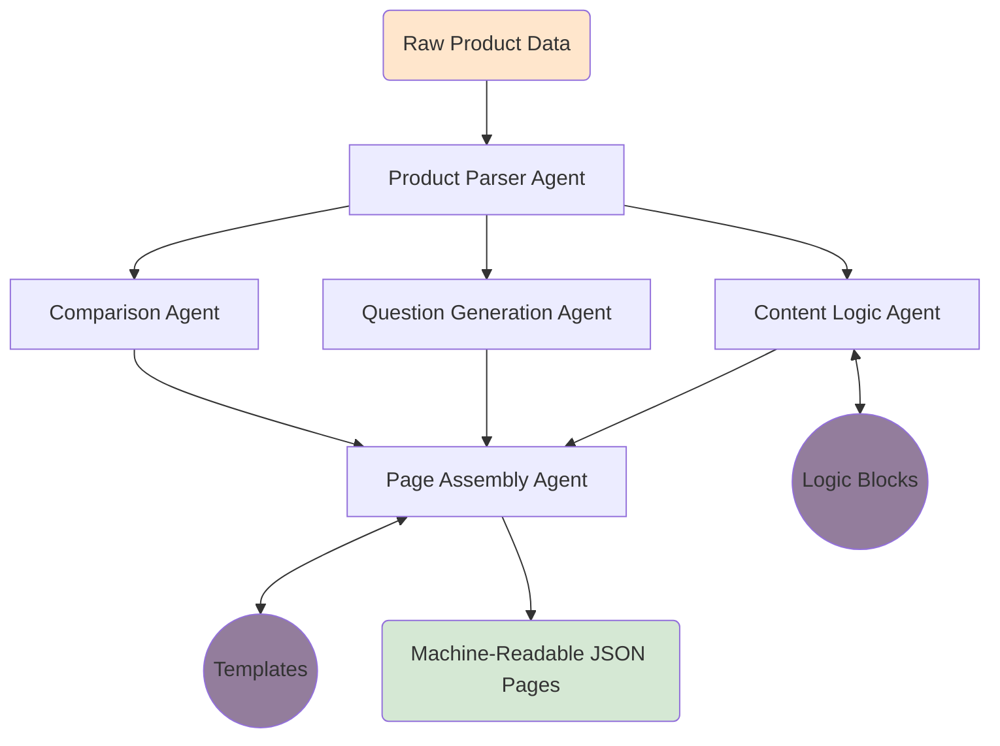

# 🧠 Multi-Agent Content Generation System

**Repository:** `kasparro-ai-agentic-content-generation-system-Shreyash-Lodhi`

---

## 📌 Overview

This project implements a **modular, agent-based automation system** that converts structured product data into **machine-readable content pages** (FAQ, Product Page, and Comparison Page).

The system is designed to demonstrate:

- multi-agent orchestration
- reusable content logic
- template-based generation
- clean data flow
- production-style system abstraction

---

## 🎯 Objective

Given a structured product dataset, the system automatically:

1. Parses and normalizes product data
2. Generates categorized user questions
3. Applies reusable content logic blocks
4. Assembles multiple content pages using templates
5. Outputs clean, machine-readable JSON files

All steps are executed via **independent agents**, coordinated by a central pipeline.

---

## 🧩 System Architecture (High Level)



- Each agent has a **single responsibility**
- Agents do **not** call each other directly
- All coordination happens in the **orchestrator pipeline**

---

## 🤖 Agents Overview

### 1️⃣ DataParserAgent

- Loads product data from JSON
- Validates required fields
- Converts raw input into a normalized internal model

### 2️⃣ QuestionGenerationAgent

- Automatically generates **15+ user questions**
- Categorizes questions by intent:
  - Informational
  - Usage
  - Safety
  - Purchase
  - Comparison

### 3️⃣ ContentLogicAgent

- Applies reusable, deterministic logic blocks
- Produces standardized content fragments (benefits, usage, safety)

### 4️⃣ ComparisonAgent

- Autonomously generates a **fictional comparison product**
- Introduces no external facts or research
- Prepares structured comparison data

### 5️⃣ PageAssemblyAgent

- Combines agent outputs with predefined templates
- Produces final page structures without embedding business logic

---

## 🧱 Reusable Content Logic Blocks

Located in `logic_blocks/`, these are **pure functions** that transform raw data into reusable content fragments:

- `benefits_block.py`
- `usage_block.py`
- `safety_block.py`

These blocks are reused across:

- FAQ Page
- Product Page
- Comparison Page

---

## 📄 Templates

Templates define **structure, not logic**.

Implemented templates:

- `faq_template.py`
- `product_template.py`
- `comparison_template.py`

Each template receives structured inputs and outputs JSON-ready dictionaries.

---

## 🔁 Orchestration Pipeline

The pipeline (`orchestrator/pipeline.py`) controls:

- execution order
- data flow between agents
- final JSON output persistence

This file represents the **automation graph / DAG controller** of the system.

---

## 📂 Project Structure

├── agents/
├── logic_blocks/
├── templates/
├── orchestrator/
├── data/
├── output/
├── docs/
└── README.md

## ▶️ How to Run

1. Ensure product data exists:
   data/product_data.json

Clone the repository using "git clone https://github.com/shreyashlodhi/kasparro-ai-agentic-content-generation-system-Shreyash-Lodhi.git"

2. Run the pipeline:

```bash
python main.py

Generated outputs:

output/
├── faq.json
├── product_page.json
└── comparison_page.json
```
