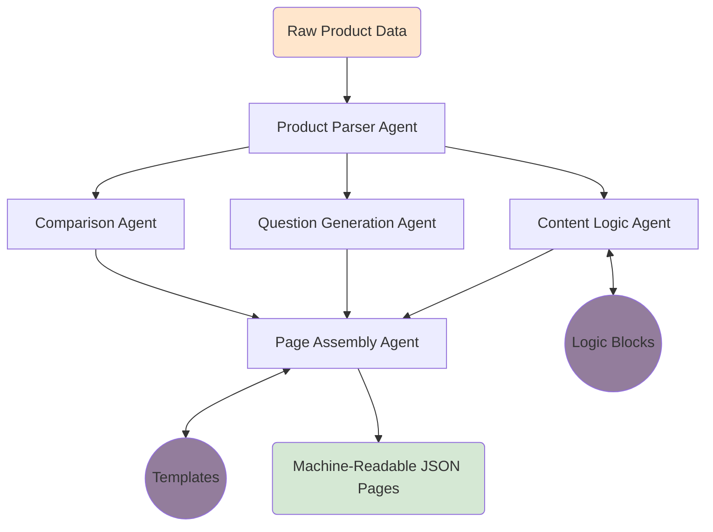

# Project Documentation

## Multi-Agent Content Generation System

---

## 1. Problem Statement

Modern content platforms require scalable and automated ways to generate structured, machine-readable content from minimal input data. Manual content creation does not scale well and often leads to inconsistent formatting and logic duplication.

The objective of this project is to design and implement a **production-style multi-agent system** that takes a small, structured product dataset and automatically generates multiple content pages in a deterministic and reusable manner.

The focus of this challenge is **system design, agent orchestration, and automation**, not domain knowledge or UI development.

---

## 2. Solution Overview

This project implements a **modular, agent-based automation pipeline** that converts raw product data into three structured content pages:

- FAQ Page
- Product Description Page
- Comparison Page

Each stage of processing is handled by a **dedicated agent** with a single responsibility. Agents communicate only through structured data, and a central orchestrator enforces execution order.

The system outputs **machine-readable JSON**, making it suitable for downstream consumption by APIs, CMS platforms, or search systems.

---

## 3. Scope & Assumptions

### Scope

- Operates strictly on the provided product dataset
- Generates content deterministically
- Uses fictional data for comparison
- Produces JSON outputs only

### Assumptions

- No external data sources or research are allowed
- Content quality is driven by structure and logic, not creativity
- The system should be easily extensible to new products or page types

---

## 4. System Design (Core Section)

### 4.1 Architectural Approach

The system is implemented as an **implicit Directed Acyclic Graph (DAG)**, where:

- Nodes represent independent agents
- Edges represent data flow between agents
- Execution follows a topological order
- No cycles or shared global state exist

This design ensures determinism, modularity, and extensibility.

---

### 4.2 High-Level Flow

---

### 4.3 Agent Responsibilities

#### 1. DataParserAgent

- Reads raw product data from JSON
- Validates required fields
- Normalizes data into a structured internal model
- Acts as the source agent for the pipeline

---

#### 2. QuestionGenerationAgent

- Automatically generates user-style questions
- Produces at least 15 questions
- Categorizes questions by intent:
  - Informational
  - Usage
  - Safety
  - Purchase
  - Comparison

This enables scalable FAQ and content generation.

---

#### 3. ContentLogicAgent

- Applies reusable content logic blocks
- Produces standardized content fragments:
  - Benefits text
  - Usage instructions
  - Safety information
- Remains independent of page templates

---

#### 4. ComparisonAgent

- Autonomously generates a fictional comparison product
- Ensures no external facts are introduced
- Prepares comparison-ready structured data

This satisfies the requirement for a comparison page without violating data constraints.

---

#### 5. PageAssemblyAgent

- Combines agent outputs with predefined templates
- Produces final page structures
- Contains no business logic or content generation

This separation keeps templates simple and reusable.

---

### 4.4 Reusable Content Logic Blocks

Content logic blocks are implemented as **pure functions**:

- `benefits_block.py`
- `usage_block.py`
- `safety_block.py`

Characteristics:

- Stateless
- Deterministic
- Reusable across multiple pages
- Easily testable

These blocks decouple content rules from page assembly.

---

### 4.5 Template System

Templates define **structure only**, not logic.

Implemented templates:

- FAQ Template
- Product Page Template
- Comparison Page Template

Each template:

- Accepts structured inputs
- Outputs JSON-ready dictionaries
- Contains no data mutation or reasoning logic

---

### 4.6 Orchestration Pipeline

The pipeline orchestrator:

- Controls execution order
- Passes structured outputs between agents
- Persists final JSON files

It serves as the **automation graph controller** and enforces DAG execution.

---

## 5. Data Flow & Output Structure

### Outputs Generated

- `faq.json`
- `product_page.json`
- `comparison_page.json`

### Output Characteristics

- Machine-readable JSON
- Deterministic and reproducible
- Clean schema mapping from data → logic → output

No free-text or UI rendering is included.

---

## 6. Design Principles

- Clear agent boundaries
- No shared global state
- Deterministic execution
- Template-based generation
- Reusable logic blocks
- Extensible architecture

---

## 7. What This System Is Not

- Not a prompt-engineering task
- Not a UI or frontend project
- Not a content writing exercise
- Not a single-script LLM wrapper

The focus is on **agentic system design and automation**.

---

## 8. Extensibility

The system can be extended to:

- Add new page types
- Introduce additional agents
- Support multiple products
- Integrate optional LLM-backed agents
- Replace JSON input with API or database sources

No core refactoring would be required.

---

## 9. Conclusion

This project demonstrates how structured content generation can be achieved through a **well-orchestrated, agent-based pipeline**. By separating concerns across agents, logic blocks, templates, and orchestration, the system remains scalable, maintainable, and production-ready.

The design aligns closely with real-world agentic automation systems used in modern AI-driven platforms.
